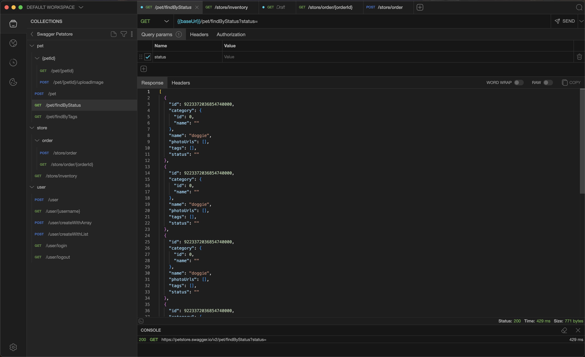

# Usage Documentation for API Calls

## Goal

API Calls helps you exercise REST services without relying on a browser or
external tools. It lets you craft HTTP requests, send them, inspect responses,
and organise them into tabs, collections, and workspaces.

## Requirements and Installation

- **Official packages**: download the latest release for Linux, macOS, or
  Windows from GitHub Releases.
- **Arch Linux**: available through the `api-calls-bin` package (AUR).
- **Running from source**:
  1. `npm install`
  2. `npm run dev` to launch the application in development mode.
  3. `npm run build:<platform>` to generate installers (linux/mac/win).

## First Run

1. On launch, the default workspace opens with the side menu collapsed.
2. Click **New Tab** (the `+` icon or `Ctrl/Cmd+T`) to prepare a new request.
3. Choose the HTTP method, enter the URL, and add the required parameters or body.
4. Press `Ctrl/Cmd+Enter` or the **Send** button to execute the request.
5. Review the response at the bottom: status, duration, size, and body.

## Interface at a Glance

- **Optional top menu**: quick access to actions, view, tools, and updates
  (toggle from Settings or `Ctrl/Cmd+M`).
- **Side menu**: tabs for _Collections_, _Environments_, _History_, _Cookies_,
  and _Settings_ (switch via shortcuts).
- **Side panel**: displays the content of the selected section (collection
  tree, environments, etc.).
- **Central tabs**: request editor, header/body configuration, and response
  viewer. Tabs support drag-and-drop reordering.
- **Bottom console**: log of sent requests and debugging messages.

## Building and Sending Requests

1. **Method and URL**: use the selectors for GET, POST, PUT, and more. URLs
   auto-complete with environment variables when selected.
2. **Query parameters**: add rows in the _Params_ section (toggle each one
   on/off).
3. **Headers**: add request headers.
   - I will overwrite collection headers.
4. **Body**: choose the mode (JSON, YAML, text, form-data,
   x-www-form-urlencoded, file). The Monaco-based editor offers syntax
   highlighting and validation. For `form-data`, a key-value editor allows sending text and files.
5. **Authentication**: configure Bearer, Basic, or custom tokens from the
   _Auth_ tab.
6. **Environment**: assign variables via _Environment_ (collections can specify
   a preferred environment).
7. **Send and cancel**: `Ctrl/Cmd+Enter` sends the request, `Esc` cancels it.
   Cancellations rely on `AbortController` and emit `REQUEST.cancelled`.

## Managing Tabs

- **Duplicate**: right-click a tab and choose _Duplicate tab_.
- **Restore**: `Ctrl/Cmd+Shift+T` reopens the last closed tab.
- **Move**: drag tabs to reorder them.
- **Search**: open the tab switcher with `Ctrl/Cmd+O` to find a tab by name.
- **Close**: `Ctrl/Cmd+W` closes the active tab.
- **Bulk close**: right-click for _Close others_ or _Close all_; both respect
  the _Confirm close_ preference (Settings > General).
- **Save a request**: `Ctrl/Cmd+S` saves to the linked collection;
  `Ctrl/Cmd+Shift+S` prompts for folder and name.

## Collections

- Create folders and sub-folders to group related requests.
- Assigning an environment to a collection propagates default variables to
  linked tabs.
- Use _Pre-request Script_ to run JavaScript before sending a request (for
  example, generating tokens).
- Import and export from the context menu: supports Postman v2, OpenAPI, and
  custom YAML/JSON files.
- Define collection headers that will be sent on requests. Thery will overwrite
  environment headers.

## Scripting

You can write JavaScript code to execute before a request is sent (Pre-request
Script) or after a response is received (Post-request Script). Scripts can be
defined at the collection level or for individual requests.

### Available Resources

The following objects are available in the script execution context:

- **console**: Use `console.log(message)` or `console.error(message)` to print
  messages to the bottom console.
- **environment**: access and modify environment variables.
  - `environment.get(key)`: Returns the value of a variable.
  - `environment.set(key, value)`: Sets or updates a variable.
  - `environment.unset(key)`: Removes a variable.
- **http**: Make asynchronous HTTP requests directly from your script.
  - `await http.get(url, headers)`
  - `await http.post(url, body, headers)`
  - `await http.put(url, body, headers)`
  - `await http.delete(url, headers)`
  - `await http.request(method, url, body, headers)`
- **request**: Access the current request details.
  - `request.method`, `request.url`, `request.headers`, `request.body`
- **response** (Post-script only): Access the received response.
  - `response.status`, `response.headers`, `response.body`, `response.rawBody`

Note: Standard browser objects like `window`, `document`, and `fetch` are not
available.

## Environments and Variables

- Define environments (dev, staging, prod) with key/value pairs.
  - Insert variables as `{{variable}}` in URLs, headers, or bodies.
  - Define environment headers that will be sent on requests. They will
    overwrite workpace headers.
- Duplicate, reorder, or export complete environments as needed.
- Pick the active environment per tab from the request toolbar.

## History and Cookies

- **History**: stores up to `maxHistory` requests (configurable) with filters
  by method and text. Reopen entries as tabs or clear them in bulk.
- **Cookies**: when _Manage cookies_ is enabled, stored cookies are listed and
  can be cleared per domain. The _View > Cookies_ menu entry is shown
  automatically when this option is active.

## Workspaces

- Separate collections, environments, tabs, and cookies per project.
- Access the list and workspace actions from the side menu (folder icon).
- Create, duplicate, rename, and remove workspaces (the default workspace
  cannot be deleted). Each workspace is stored in its own electron-store file.
- Define workpace headers that will be sent on requests. They will overwrite
  headers defined on settings.

## Settings

- **Appearance**:
  - Theme (Auto, Light, Dark, High Contrast, and more)
  - Window mode (Custom vs Native) (Linux/Windows)
  - Request orientation (horizontal/vertical)
- **Behavior**:
  - Menu visibility (`Ctrl/Cmd+M`) (Linux/Windows)
  - Auto-scroll to the active tab
  - Show/hide notifications
  - Confirmation prompts
  - Save last response
- **Network**:
  - Request timeout
  - Redirect handling
  - SSL rejection
- **Default headers**:
  - define headers that should be applied automatically to every request

## Auto Updates (Beta)

- On macOS and Windows, the app checks for updates in the background. A
  notification appears when a download starts and offers to restart once it is
  ready to install.
- On Linux, a message explains that auto updates are not available; install new
  versions manually.

## Essential Shortcuts

- Tabs:
  - `Ctrl/Cmd+T` - New tab
  - `Ctrl/Cmd+W` - Close tab
  - `Ctrl+Tab` and `Ctrl+Shift+Tab` - Navigate tabs
  - `Ctrl/Cmd+Shift+T` - Restore tab
  - `Ctrl/Cmd+O` - Find tab
- Requests:
  - `Ctrl/Cmd+Enter` - Send request
  - `Ctrl/Cmd+S` - Save request
  - `Ctrl/Cmd+Shift+S` - Save request as
  - `Esc` - Cancel request
  - `Ctrl/Cmd+Shift+C` - Toggle console
  - `Ctrl/Cmd+Shift+P` - Toggle request panel
- Navigation:
  - `Ctrl/Cmd+B` - Sidebar
  - `Ctrl/Cmd+P` - Find request
  - `Ctrl/Cmd+G` - Cookies
  - `Ctrl/Cmd+H` - History
  - `Ctrl/Cmd+L` - Collections
  - `Ctrl/Cmd+E` - Environments
  - `Ctrl/Cmd+,` - Settings
- Developer:
  - `F12` or `Ctrl/Cmd+Shift+I` - Open DevTools

## Tips and Troubleshooting

- If an HTTPS call fails due to certificates, temporarily disable _Reject
  unauthorized_ in Settings (testing environments only).
- Check the bottom console for validation messages or parsing errors.
- Use _Restore tab_ to recover accidentally closed tabs.
- To reset preferences, choose _Reset to defaults_ in Settings; the menu
  updates automatically.

## Where Data Lives

- Collections, environments, tabs, and cookies are stored per workspace under
  Electron's user data directory (`userData`).
- Export collections or environments to share them or keep backups.

## Additional Resources

- GitHub repository: <https://github.com/elpeix/apicalls>
- Issues and feedback: use **Help > Submit bug** or open a ticket on GitHub.
